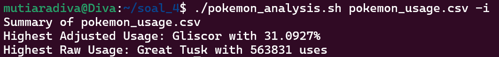
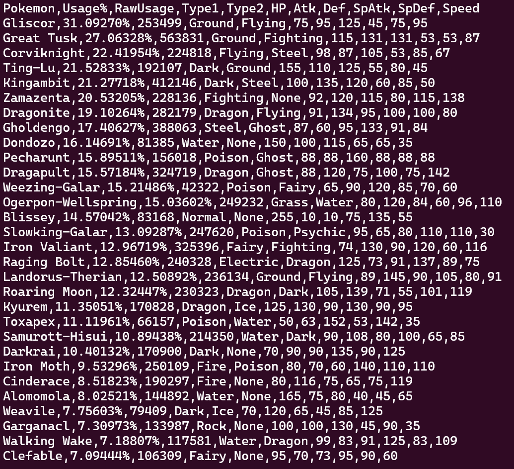
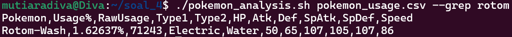
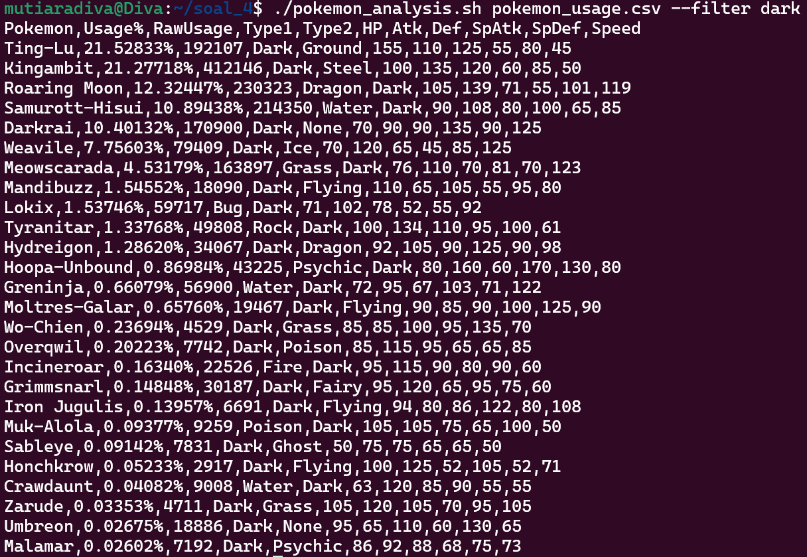
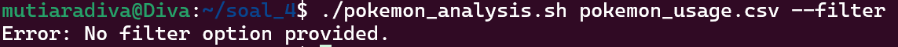
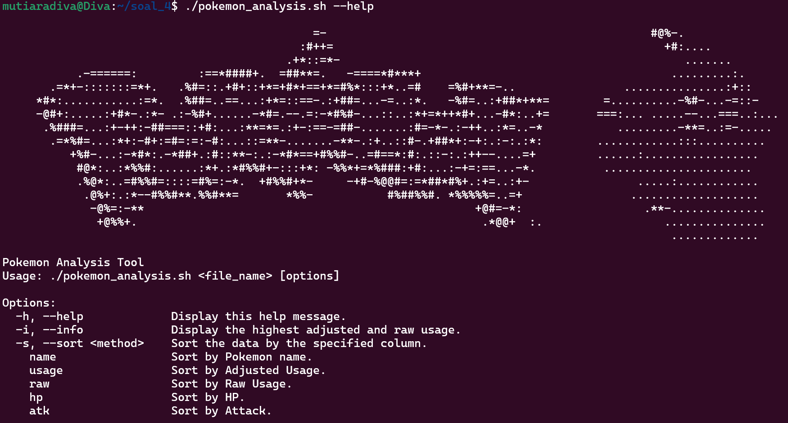

# LAPRES Praktikum Sistem Operasi Modul 1 - IT14

## Anggota
1. Muhammad Fatihul Qolbi Ash Shiddiqi (5027241023)
2. Mutiara Diva Jaladitha (5027241083)
3. M. Faqih Ridho (5027241123)

## DAFTAR ISI
- [Soal 1](#soal-1)
- [Soal 2](#soal-2)
- [Soal 3](#soal-3)
- [Soal 4](#soal-4)

# Soal 1
**DIkerjakan Oleh M Faqih Ridho (5027241123)**

## Deskripsi Soal
1.Poppo dan siroyo memiliki tablet yang didalamnya terdapat file reading_data.csv. Kita disuruh untuk menelusuri file yang ada pada file tersebut dengan kriteria-kriteria tertentu
```
mkdir poppo_siroyo.sh
cd poppo_siroyo.sh
wget --content-disposition "https://drive.google.com/uc?export=download&id=1l8fsj5LZLwXBlHaqhfJVjz_T0p7EJjqV"
```
Pertama saya membuat file directory. Lalu masuk kedalam directory.Lalu, mendownload file reading_data.csv.


#### 1. A
1. A Membuat filter dengan kriteria berapa banyak buku yang dibaca oleh Chris Hemsworth di file reading_data.csv
berikut commmand secara keseluruhan yang saya gunakan:
```
awk '{ jumlah +=1; if ($0 ~ /Chris Hemsworth/) { ++n } } END { if (n > 0) print "Chris Hemsworth membaca", n, "buku."; else print "Chris Hemsworth tidak membaca buku."; }' reading_data.csv
```

### Cara Pengerjaan 
" '{ jumlah +=1; if ($0 ~ /Chris Hemsworth/) { ++n } }" adalah inisialisasi awal sebelum membaca input dibaca. Jumlah adalah semacam variabel yang akan bertambah 1 Jika apakah seluruh baris menggandung kata Chris Hemsworth , jika iya n akan bertambah dengan menampung angkanya. kenapa menggunakan ~ (regex) bukan == karena regex lebih fleksibel jika dengan huruf besar dan kecil walaupun saya mengakui itu kesalahan karena lebih bagus mengguakan == agar sesuai ketentuan.

"END { if (n > 0) print "Chris Hemsworth membaca", n, "buku."; else print "Chris Hemsworth tidak membaca buku."; }'"
setelah input sudah dibaca (END), maka berlaku ketentuan. Jika N > 0 (penambahan setiap bertemu nama Chris Hemsworth) maka mencetak "Chris Hemsworth membaca", n, "buku." dengan n adalah variabel yang menampung jumlah bukunya. jika tidak maka tercetak kalimat "Chris Hemsworth tidak membaca buku.".

"reading_data.csv" adalah file yang di baca.

### Kendala
 1.saya salah menuliskan nama pembacanya chris hemsworth padahal Chris Hemsworth
 2. Saya tidak membaca note dimana harus menggunakan if else

### Solusi
1. saya meneliti command nya sudah sesuai pada GitHub modul 1 maka saya mencoba melihat soal dan ternyata salah huruf kapital.
2. Saya menata ulang lagi command nya agar mengandung if-else

### Gambar 


#### 1. B
1. B Siroyo penasaran berapa waktu rata-rata membaca menggunakan perangkat tablet pada file reading_data.csv
   
Berikut command keseluruhan yang saya gunakan :
```
awk 'BEGIN{FS=","} { if ($8 == "Tablet") { total+=$6; hitung++ } }
 END { if (hitung > 0) {print "Rata-rata durasi membaca dengan Tablet adalah", total/hitung, "menit"}
 else{ print "Tidak ada data membaca dengan Tablet." }}' reading_data.csv
```

### Cara Pengerjaan
" 'BEGIN{FS=","} { if ($8 == "Tablet") { total+=$6; hitung++ } } " command awal BEGIN digunakan untuk eksekusi sebelum file dibaca.FS/field separator adalah pemisah kolom dalam kasus ini menggunakan "," .  " if ($8 == "Tablet") { total+=$6; hitung++ }" Jika kolom 8 mengandung kata Tablet, maka variabel total yang menampung kolom 6 yang berisi durasi membaca akan terus bertambah. Lalu variabel hitung++ menambahkan jumlah baris agar dapat menghitung rata-ratanya.

"END { if (hitung > 0) {print "Rata-rata durasi membaca dengan Tablet adalah", total/hitung, "menit"}
 else{ print "Tidak ada data membaca dengan Tablet." }}'"  Setelah input sudah dibaca (END) , berlaku ketentuan. Jika hitung >0 maka cetak "Rata-rata durasi membaca dengan Tablet adalah", total/hitung, "menit" dimana total : hitung adalah menghitung rata-rata durasi membaca. Jika hitung  < 0 maka mencetak "Tidak ada data membaca dengan Tablet.".

 "reading_data.csv" adalah file data yang dibaca

 ### Kendala
 1.saya bingung apa yang membuat perintah menggunakan {} dan tidak , karena $8 =="Tablet" tidak menggunakan {} saya mencontohnya pada modul GitHub NR==2.
2.Saya tidak membaca note terakhir

### Solusi 
1. saya menemukan pada website geeksforgeeks bahwa penyusunan awk adalah
awk [options] 'pattern { action }' input-file(s). dimana patern adalah kondisi yang dicek setiap barisnya dan action merupakan eksekusi dengan syarat pattern terpenuhi
2. Saya Menyesuaikan command agar menggunakan if-else

### Gambar


#### 1.C
1.C Poppo mencari siapa yang memberikan rating tertinggi untuk buku yang dibaca (Rating) beserta nama (Name) dan judul bukunya (Book_Title) pada file reading_data.csv
Berikut command secara keseluruhan yang saya gunakan :
```
awk 'BEGIN {FS=","; Maks=0} { if (NR > 1) { if ($7 > Maks) { Maks=$7; nama=$2; JudulBuku=$3 } } }
 END { if (Maks > 0) {print "Pembaca dengan rating tertinggi:", nama, "-", JudulBuku, "-", Maks}
else {print "Tidak ada data rating yang valid." }}' reading_data.csv
```
### Cara Pengerjaan

Saya menggunakan filter awk untuk mencari hal yang kita inginkan. "BEGIN {FS=","; Maks=0}" BEGIN adalah eksekusi yang dijalankan sebelum masuk ke file nya. FS/field separator adalah pemisah kolom dalam kasus ini menggunakan "," .Maks adalah semacam variabel yang di inisialisasi int karena kalau tidak akan secara default string.

"{ if (NR > 1) { if ($7 > Maks) { Maks=$7; nama=$2; JudulBuku=$3 } } }"  adalah filternya. NR >1 berarti pembacaan dimulai dari baris >1 karena baris pertama merupakan string. maks adalah variabel yang menampung setiap baris yang ada pada kolom 7. nama adalah variabel yang menampung baris kolom 2 dan JudulBuku adalah variabel yang menampung baris pada kolom 3. Semua variabel tadi akan berganti nilai ke baris selanjutnya jika "($7 > Maks)" ada rating pada baris selanjutnya yang melebihi pada baris sebelumnya. 

"END { if (Maks > 0) {print "Pembaca dengan rating tertinggi:", nama, "-", JudulBuku, "-", Maks}
else {print "Tidak ada data rating yang valid." }}'" . END akan dijalankan hanya ketika semua input telah dibaca / filter dari begin tadi. Jika maks > 0 maka akan menampilkan kata-kata "Pembaca dengan rating tertinggi:" lalu bisa menampilkan nilai variabel dengan memisahkannya dengan ",". Lalu, masukkan varibel seperti pada contoh yaitu nama. lalu "-". masukkan variabel lagi yaitu JudulBuku.Lalu, "-". MAsukkan variabel lagi yaitu Maks agar sesuai tamplate soal. Jika file <0 , maka akan menampilkan kalimat "Tidak ada data rating yang valid.".

"reading_data.csv" adalah file yang menjadi acuannya

### Kendala
1.saya salah penulisan pemanggian variable ternyata awk itu case sensitive
2. Saya awalnya tidak menyimpan kolom 2 dan 3 dalam variable sehingga tidak tercetak sebagai syarat rating tertinggi malah mencetak baris terakhir makanya saya menambahkan variabel
3. Saya awalnya tidak menggunakan FS sebagai pemisah kolom jadi outputnya tidak jelas
4. perbandingan kolom ke 7 yaitu rating awalnya terhambat karena baris pertama adalah string sehingga baris lain tidak dieksekusi jadi saya memutuskan untuk melewati baris pertama.

### Solusi 
1.	Saya lebih teliti lago
2.	Saya tambahkan variable yang menampung kolom 2 dan 3
3.	Saya menambahkannya
4.	Saya melewati baris pertama
   
### Gambar


#### 1. D
1.D Siroyo ingin mengetahui berapa buku untuk Genre buku paling populer di Asia setelah 31 Desember 2023 pada file reading_data.csv
```
awk 'BEGIN { FS="," } NR > 1 && $5 > "2023-12-31" && $9 ~ /Asia/ { Ngitung_Genre[$4]++ } END { Jenis_Genre=""; Jumlah_Genre_Terbanyak=0; for (n in Ngitung_Genre) { if (Ngitung_Genre[n] > Jumlah_Genre_Terbanyak) { Jenis_Genre=n; Jumlah_Genre_Terbanyak=Ngitung_Genre[n] } } if (Jumlah_Genre_Terbanyak>0) { print "Genre paling populer di Asia setelah 2023 adalah", Jenis_Genre, "dengan", Jumlah_Genre_Terbanyak, "buku" } else { print "Tidak ada Genre favorit" } }' reading_data.csv
```
### Cara Pengerjaan
“'BEGIN { FS="," } NR > 1 && $5 > "2023-12-31" && $9 ~ /Asia/ { Ngitung_Genre[$4]++ }”  diawali dengan BEGIN yaitu eksekusi sebelum input file dibaca. Syarat pertama,NR /Number Record  > 1 artinya baris pertama dilewati karena mengandung string. Syarat kedua yaitu  “$5 > "2023-12-31" “ dimana Kolom 5 harus lebih dari ketentuan waktu 31 desember 2023. Syarat Ketiga yaitu “ $9 ~ /Asia/” dimana kolom 9 harus mengandung kata Asia. Perlu diketahui bahwa penggunaan Asia agar yang mengandung kata tidak hanya Asia bisa termasuk seperti Asia Tenggara. Ketiga syarat akan menambah angka variable Ngitung_Genre pada kolom 4.

“END { Jenis_Genre=""; Jumlah_Genre_Terbanyak=0;” END sebagai eksekusi setelah input dibaca. Jenis_Genre adalah variable dengan tipe data string dan Jumlah_Genre_Terbanyak adalah variabel dengan int.

“for (n in Ngitung_Genre) {if (Ngitung_Genre[n] > Jumlah_Genre_Terbanyak) { Jenis_Genre=n; Jumlah_Genre_Terbanyak=Ngitung_Genre[n] } } “ Perulangan ditampung pada variable n yang mengambil nilai key dari Ngitung_Genre. Lalu dibandingkan apakah Jumlah Ngitung_Genre[n] > Jumlah_Genre_terbanyak yang awal di inisialisasi dengan 0. Jika iya, maka Jenis_Genre yang menampung string akan menjadi string/nama genre dari Ngitun_genre Dan Jumlah_Genre_Terbanyak yang menampung int akan mengambil angkanya Ngitung Genre. Iterasi selanjutnya akan membandingkan Genre yang paling banyak muncul

“ if (Jumlah_Genre_Terbanyak>0) { print "Genre paling populer di Asia setelah 2023 adalah", Jenis_Genre, "dengan", Jumlah_Genre_Terbanyak, "buku" } else { print "Tidak ada Genre favorit" } }' “
Jika sudah ditemukan Jumlah_Genre_Terbanyak >0 maka mencetak "Genre paling populer di Asia setelah 2023 adalah", Jenis_Genre, "dengan", Jumlah_Genre_Terbanyak, "buku" dengan Jenis_Genre dan Jumlah_Genre_Terbanyak dipanggil dari variabel. jika <0 ,maka mencetak "Tidak ada Genre favorit".


### Kendala
1. pada penulisan saya karena menggunakan 1 line itu ada yang terpenggal variable nya an tidak dapat dieksekusi

### Solusi 
1. saya membentuk Jarak dengan spasi sehingga tidak terpenggal dan dapat dieksekusi

### Gambar


# Soal 2

**Dikerjakan Oleh:
Muhammad Fatihul Qolbi Ash Shiddiqi (5027241023)
Mutiara Diva Jaladitha (5027241083)
M. Faqih Ridho (5027241123)**

## Deskripsi Soal 

Membuat sdua shell script, login.sh dan register.sh, yang dimana database “Player” disimpan di /data/player.csv. Untuk register, parameter yang dipakai yaitu email, username, dan password. Untuk login, parameter yang dipakai yaitu email dan password. Email harus memiliki format yang benar dengan tanda @ dan titik, sementara password harus memiliki minimal 8 karakter, setidaknya satu huruf kecil, satu huruf besar, dan satu angka. Sistem login/register tidak bisa memakai email yang sama (email = unique), tetapi tidak ada pengecekan tambahan untuk username. Password perlu disimpan dalam bentuk yang tidak mudah diakses dan menggunakan algoritma hashing sha256sum yang memakai static salt (bebas). Program ini dijalankan dengan cara ./terminal.sh

#### A. “First Step in a New World”

```bash
nano login.sh
```
- `nano login.sh`: Membuat script logindengan parameter email dan password.

```bash
nano register.sh
```
- `nano register.sh`: Membuat script register dengan parameter email. username, dan password.

```bash
mkdir data && cd data && touch player.csv
```
- `mkdir data`: Membuat folder bernama data
- `cd data`: Masuk ke dalam folder data
- `touch player.csv`: membuat file bernama player.csv

#### B. “Radiant Genesis”

```bash
validate_email() {
    local email="$1"
    if [[ "$email" =~ ^[a-zA-Z0-9._%+-]+@[a-zA-Z0-9.-]+\.[a-zA-Z]{2,}$ ]]; then
        return 0
    else
        return 1
    fi
}
```
- `^[a-zA-Z0-9._%+-]+`: Karakter sebelum '@' (boleh huruf, angka, titik, underscore, dll).
- `@[a-zA-Z0-9.-]+`: Karakter setelah '@' (harus domain yang valid).
- `\.[a-zA-Z]{2,}$`: Ekstensi domain minimal 2 karakter (misal `.com`, `.id`, `.org`).

```bash
validate_password() {
    local password="$1"
    if [[ "$password" =~ [A-Z] ]] && \
       [[ "$password" =~ [a-z] ]] && \
       [[ "$password" =~ [0-9] ]] && \
       [[ ${#password} -ge 8 ]]; then
        return 0
    else
        return 1
    fi
}
```
- `validate_password()`: Fungsi ini memeriksa apakah password memenuhi kriteria berikut:
✅ Minimal 8 karakter
✅ Memiliki setidaknya 1 huruf besar
✅ Memiliki setidaknya 1 huruf kecil
✅ Memiliki setidaknya 1 angka

#### C. “Unceasing Spirit”

```bash
if grep -q "^$email," "$DB_FILE"; then
    echo "Email sudah terdaftar!"
    exit 1
fi
```
- `grep -q`: Mengecek apakah email sudah ada di file database.
- `^$email,`: Regex yang memastikan hanya mencocokkan email pada awal baris (agar tidak tertukar dengan email yang mirip).

#### D. “The Eternal Realm of Light”

```bash
DB_FILE="./data/player.csv"
SALT="arc@eaS3cR3t"
hashed_password=$(echo -n "$password$SALT" | sha256sum | awk '{print $1}')
```
- `DB_FILE`: Menentukan lokasi file database tempat data pengguna disimpan.
- `SALT`: String tetap yang digunakan sebagai tambahan dalam hashing password untuk meningkatkan keamanan.
- Menggabungkan password dengan `SALT` untuk memperkuat hashing.
- Menggunakan `sha256sum` untuk menghasilkan hash.
- `awk '{print $1}'` mengambil hanya nilai hash tanpa karakter tambahan.

#### E “The Brutality of Glass”
```
#!/bin/bash
btop

# Path ke folder logs yang berada di luar direktori skrip
LOG_DIR="../logs"
LOG_FILE="$LOG_DIR/core.log"

# Buat folder logs jika belum ada
mkdir -p "$LOG_DIR"

# Fungsi untuk mendapatkan penggunaan CPU
get_cpu_usage() {
    # Baca stat CPU dari /proc/stat
    CPU_STAT=$(grep '^cpu ' /proc/stat)
    CPU_STAT_ARRAY=($CPU_STAT)

    # Hitung total waktu CPU
    TOTAL=0
    for value in "${CPU_STAT_ARRAY[@]:1:8}"; do
        TOTAL=$((TOTAL + value))
    done
    IDLE=${CPU_STAT_ARRAY[4]}

    # Hitung perubahan dan persentase penggunaan CPU
    if [[ -n "$PREV_TOTAL" && -n "$PREV_IDLE" ]]; then
        DIFF_TOTAL=$((TOTAL - PREV_TOTAL))
        DIFF_IDLE=$((IDLE - PREV_IDLE))
        DIFF_USAGE=$(( (100 * (DIFF_TOTAL - DIFF_IDLE)) / DIFF_TOTAL ))
    else
        DIFF_USAGE=0
    fi

    # Simpan nilai saat ini untuk penggunaan berikutnya
    PREV_TOTAL=$TOTAL
    PREV_IDLE=$IDLE

    echo "$DIFF_USAGE"
}

# Fungsi untuk mendapatkan model CPU
get_cpu_model() {
    CPU_MODEL=$(grep -m 1 "model name" /proc/cpuinfo | awk -F ': ' '{print $2}')
    echo "$CPU_MODEL"
}

# Ambil informasi CPU
CPU_USAGE=$(get_cpu_usage)
CPU_MODEL=$(get_cpu_model)

# Format waktu untuk log
TIMESTAMP=$(date "+%Y-%m-%d %H:%M:%S")

# Format output log
LOG_ENTRY="[$TIMESTAMP] - Core Usage [$CPU_USAGE%] - Terminal Model [$CPU_MODEL]"

# Simpan log
echo "$LOG_ENTRY" >> "$LOG_FILE"

# Tampilkan hasil di terminal
echo "$LOG_ENTRY"

```
#### penjelasan
1.#!/bin/bash: Baris ini menandakan bahwa skrip akan dijalankan menggunakan shell Bash.
2. btop: Perintah ini menjalankan aplikasi btop, sebuah tool monitoring sistem berbasis teks yang menampilkan informasi penggunaan sumber daya secara visual.
3.LOG_DIR="../logs": Mendefinisikan path folder logs yang terletak satu tingkat di atas direktori skrip.
4.LOG_FILE="$LOG_DIR/core.log": Mendefinisikan file log yang akan digunakan untuk menyimpan data monitoring.
5. mkdir -p "$LOG_DIR": Membuat folder logs jika folder tersebut belum ada. Opsi -p memastikan pembuatan folder induk bila diperlukan.
6. fungsi get_cpu_usage() 
-Membaca Data CPU:Mengambil baris yang dimulai dengan cpu dari file /proc/stat yang berisi statistik penggunaan CPU.
-Mengonversi ke Array:Data tersebut dipecah menjadi array (CPU_STAT_ARRAY) sehingga setiap nilai bisa diakses secara individual.
-Menghitung Total Waktu CPU:Dengan menggunakan perulangan, skrip menjumlahkan delapan nilai pertama (setelah kata cpu) yang menunjukkan berbagai waktu kerja CPU, sehingga didapat total waktu.
-Mengambil Waktu Idle:Nilai idle diambil dari elemen ke-5 dalam array (indeks 4), karena itulah posisi waktu idle dalam file /proc/stat.
-Menghitung Persentase Penggunaan:Jika terdapat nilai sebelumnya (PREV_TOTAL dan PREV_IDLE), skrip menghitung selisih total waktu dan selisih waktu idle.
7. Fungsi get_cpu_model
-Fungsi ini mencari baris pertama yang mengandung kata "model name" di file /proc/cpuinfo.
-Menggunakan awk, skrip memisahkan baris tersebut berdasarkan delimiter : dan mengambil bagian kedua, yaitu nama model CPU.
-Hasilnya ditampilkan dengan echo
8. Sisanya sesuai komentar yang ada pada pemrograman.

#### F. “In Grief and Great Delight”
```
#!/bin/bash
bpytop

# Path ke folder logs yang berada di luar direktori skrip
LOG_DIR="../logs"
LOG_FILE="$LOG_DIR/fragment.log"

# Buat folder logs jika belum ada
mkdir -p "$LOG_DIR"

# Fungsi untuk mendapatkan penggunaan RAM
get_ram_usage() {
    # Baca informasi RAM dari /proc/meminfo
    RAM_INFO=$(grep -E 'MemTotal|MemAvailable' /proc/meminfo)
    TOTAL_RAM=$(echo "$RAM_INFO" | grep 'MemTotal' | awk '{print $2}')
    AVAILABLE_RAM=$(echo "$RAM_INFO" | grep 'MemAvailable' | awk '{print $2}')

    # Konversi dari KB ke MB
    TOTAL_RAM=$((TOTAL_RAM / 1024))
    AVAILABLE_RAM=$((AVAILABLE_RAM / 1024))
    USED_RAM=$((TOTAL_RAM - AVAILABLE_RAM))

    # Hitung persentase penggunaan RAM
    RAM_USAGE_PERCENT=$(echo "scale=2; ($USED_RAM / $TOTAL_RAM) * 100" | bc)

    echo "$RAM_USAGE_PERCENT"
}

# Fungsi untuk mendapatkan fragmentasi RAM
get_fragment_count() {
    # Contoh: Hitung fragmentasi RAM (ini hanya contoh, Anda bisa menyesuaikan dengan kebutuhan)
    FRAGMENT_COUNT=$(vmstat -s | grep "fragmented memory" | awk '{print $1}')
    echo "$FRAGMENT_COUNT"
}

# Ambil informasi RAM
RAM_USAGE=$(get_ram_usage)
FRAGMENT_COUNT=$(get_fragment_count)

# Format waktu untuk log
TIMESTAMP=$(date "+%Y-%m-%d %H:%M:%S")

# Format output log
LOG_ENTRY="[$TIMESTAMP] - Fragment Usage [$RAM_USAGE%] - Fragment Count [$FRAGMENT_COUNT MB] - Details [Total: $TOTAL_RAM MB, Available: $AVAILABLE_RAM MB]"

# Simpan log
echo "$LOG_ENTRY" >> "$LOG_FILE"

# Tampilkan hasil di terminal
echo "$LOG_ENTRY"

```
#### Penjelasan
1.#!/bin/bash: Menentukan bahwa skrip akan dijalankan menggunakan shell Bash.
2.bpytop: Menjalankan aplikasi bpytop yang menampilkan monitoring sistem secara visual, mirip dengan btop pada skrip sebelumnya.
3.Pengaturan Lokasi Log:Menetapkan path folder log (../logs) dan file log (fragment.log) di dalam folder tersebut.
4.mkdir -p "$LOG_DIR": Membuat folder logs jika belum ada, memastikan bahwa lokasi untuk menyimpan log sudah tersedia.
5. Function get_ram_usage()
-Mengambil Informasi RAM:Fungsi ini mengambil dua baris penting dari file /proc/meminfo:
MemTotal untuk total memori.MemAvailable untuk memori yang tersedia saat ini.
-Pemrosesan Data:Menggunakan grep dan awk untuk mengekstrak nilai memori (dalam satuan KB).
Nilai-nilai tersebut dikonversi ke MB dengan membagi angka dengan 1024.
Menghitung memori yang telah terpakai dengan mengurangi memori yang tersedia dari total memori.
-Menghitung Persentase:Persentase penggunaan RAM dihitung menggunakan kalkulasi di bc dengan skala dua angka di belakang koma untuk presisi.
-Output:
Fungsi mengeluarkan (echo) nilai persentase penggunaan RAM.
6. function get_fragment_count() 
-Penggunaan vmstat -s:
Fungsi ini menggunakan perintah vmstat -s untuk menampilkan statistik memori dalam sistem.
-Mencari Baris Fragmentasi:
Dengan grep, mencari baris yang mengandung "fragmented memory" dan mengambil nilai numeriknya dengan awk.
-Catatan:
Bagian fragmentasi ini bersifat contoh (placeholder) dan dapat disesuaikan atau dikembangkan lebih lanjut sesuai kebutuhan monitoring fragmentasi di sistem yang digunakan.
-Output:
Nilai fragmentasi yang diperoleh kemudian dikembalikan melalui echo.
7. Sisanya sesuai komentar pemrograman.

# Soal 3

**Dikerjakan Oleh Muhammad Fatihul Qolbi Ash Shiddiqi (5027241023)**

## Deskripsi Soal 

Membuat sebuah script bertemakan setidaknya 5 dari 10 lagu dalam album tersebut. Sebagai Peserta kamu memutuskan untuk memilih Speak to Me, On the Run, Time, Money, dan Brain Damage. Saat program ini dijalankan, terminal harus dibersihkan terlebih dahulu agar tidak mengganggu tampilan dari fungsi fungsi yang kamu buat. Program ini dijalankan dengan cara ./dsotm.sh --play=”<Track>” 

- **Speak to Me**: Menampilkan *word of affirmation* dari API setiap detik  
- **On the Run**: Progress bar dengan interval waktu acak  
- **Time**: Live clock dengan tampilan waktu lengkap  
- **Money**: Matrix effect dengan simbol mata uang  
- **Brain Damage**: Live system monitor seperti task manager  

#### A. Speak to Me - Word of Affirmation

Mengambil data dalam https://github.com/annthurium/affirmations untuk menampilkan word of affirmation setiap detik.

```bash
while true; do
    curl -s https://www.affirmations.dev/ | jq -r '.affirmation'
    sleep 1
done
```

- `clear` → Membersihkan terminal sebelum menampilkan output  
- `while true` → Membuat infinite loop  
- `curl -s` → Mengambil data dari API secara silent (tanpa progress bar)  
- `jq -r '.affirmation'` → Parsing JSON dan ekstrak data `"affirmation"`  
- `sleep 1` → Jeda 1 detik sebelum loop berikutnya  

> Note:
> - Pastikan package jq sudah terinstall (sudo apt install jq)
> - Jika API tidak tersedia, akan muncul error JSON parsing

##### Output 


#### B. On The Run - Progress Bar ( Loading )

```bash
clear
echo -e "\nSabar Ya Lagi Loading ....."
progress=0
bar_length=$(($(tput cols)-10))

while [ $progress -lt 100 ]; do
    sleep $(awk -v min=0.1 -v max=1 'BEGIN{srand(); print min+rand()*(max-min)}')
    
    progress=$((progress + RANDOM%3 + 1))
    [ $progress -gt 100 ] && progress=100
    
    filled=$(printf "_%.0s" $(seq 1 $((progress*bar_length/100))))
    printf "\r[%-${bar_length}s] %d%%" "$filled" "$progress"
done
```


- `tput cols` → Mendapatkan lebar terminal untuk progress bar responsif  
- `awk -v min=0.1 -v max=1 ` → Menghitung waktu `sleep` acak antara 0.1-1 detik  
- `$RANDOM%3 +1` → Increment progress acak (1-3%) per iterasi  
- `printf "_%.0s"` → Membuat string filled dengan karakter `_`  
- `\r` → Kembali ke awal baris untuk update progres  

##### Output 


#### C. Time - Waktu berjalan sesuai dengan keadaan saat ini

```bash
clear
tput civis
trap 'tput cnorm; clear' EXIT

while true; do
    tput cup 0 0
    date +"%Y-%m-%d %H:%M:%S"
    sleep 1
done
```

- `tput civis` → Menyembunyikan kursor  
- `trap 'tput cnorm; clear' EXIT` → Mengembalikan kursor saat program berhenti  
- `tput cup 0 0` → Memindahkan kursor ke pojok kiri atas  
- `date +"%Y-%m-%d %H:%M:%S"` → Format waktu lengkap dengan detik  
- `sleep 1` → Update setiap 1 detik  

##### Output


#### D. Money - Membuat Cmatrix dengan simbol Mata Uang

```bash
symbols=('$' '€' '£' '¥' '¢' '₹' '₩' '₿' '₣')
colors=('\e[32m' '\e[33m' '\e[34m' '\e[35m' '\e[36m')
echo -ne "\e[?25l"

cols=$(tput cols)
lines=$(tput lines)
declare -A matrix

for ((i=1; i<=lines; i++)); do
    for ((j=1; j<=cols; j++)); do
        matrix[$i,$j]=" "
    done
done

while true; do
    # Update kolom atas
    for ((j=1; j<=cols; j++)); do
        (( RANDOM % 20 == 0 )) && matrix[1,$j]="${colors[RANDOM%5]}${symbols[RANDOM%9]}\e[0m"
    done
    
    for ((i=lines; i>1; i--)); do
        for ((j=1; j<=cols; j++)); do
            matrix[$i,$j]=${matrix[$((i-1)),$j]}
        done
    done
    

    clear
    for ((i=1; i<=lines; i++)); do
        line=""
        for ((j=1; j<=cols; j++)); do
            line+="${matrix[$i,$j]}"
        done
        echo -n "$line"
    done
    sleep 0.05
done
```

- `matrix 2D array` → Menyimpan status layar  
- `RANDOM % 20` → Probabilitas 5% munculkan simbol baru
- `ANSI color codes` → Menghasilkan warna acak  
- `Double loop` → Menggeser semua karakter ke bawah  
- `sleep 0.05` → jeda sebelum menampilkan simbol lain setiap 0,05 detik

##### Output


#### E. Brain Damage - Task Manager

```bash
clear
tput civis
trap 'tput cnorm; exit' INT

while true; do
    tput cup 0 0
    echo "===== Memory Usage ====="
    free -m | awk 'NR==2{printf "Total: %sMB | Used: %sMB | Free: %sMB\n", $2, $3, $4}'
    
    echo -e "\n===== Top Processes ====="
    ps -eo pid,%mem,%cpu,comm --sort=-%mem | head -n 10
    
    sleep 1
done
```

- `free -m` → Menampilkan penggunaan memori dalam MB  
- `ps -eo` → Menampilkan daftar proses dengan format khusus  
- `--sort=-%mem` → Mengurutkan proses berdasarkan penggunaan memori tertinggi  
- `tput cup` → Memposisikan kursor untuk refresh layar tanpa `clear` untuk menghindari flicker  

##### Output 


# Soal 4

**Dikerjakan Oleh Mutiara Diva Jaladitha (5027241083)**

## Deskripsi Soal 

Membuat sebuah script bernama pokemon_analysis.sh dengan fitur melihat summary dari data pokemon, mengurutkan pokemon berdasarkan data kolom, mencari nama pokemon tertentu, mencari pokemon berdasarkan filter nama type, error handling, dan help screen yang menarik. Program ini dijalankan dengan cara ./pokemon_analysis.sh -h atau ./pokemon analysis.sh --help.

#### A. Melihat summary dari data

```bash
wget -q "https://drive.usercontent.google.com/u/0/uc?id=1n-2n_ZOTMleqa8qZ2nB8ALAbGFyN4-LJ&export=download" -O pokemon_usage.csv
```

- Mengunduh file `pokemon_usage.csv` dari URL yang diberikan.
- Opsi `-q` membuat wget berjalan tanpa output.
- Opsi `-O` menentukan nama file yang akan disimpan.

```bash
if [ "$COMMAND" == "-i" ] || [ "$COMMAND" == "--info" ]; then
    awk -F',' 'NR > 1 {
        gsub("%", "", $2)

        usage = $2 + 0
        raw = $3 + 0

        if (usage > max2) {
            max2 = usage
            name2 = $1
        }
        if (raw > max3) {
            max3 = raw
            name3 = $1
        }
    }
    END {
        print "Summary of", FILENAME
        print "Highest Adjusted Usage:", name2, "with", max2 "%"
        print "Highest Raw Usage:", name3, "with", max3 " uses"
    }' "$FILE"
```
- Membaca file CSV menggunakan `awk`.
- Menghapus tanda `%` dari kolom 2 (Adjusted Usage).
- Menyimpan Pokémon dengan Adjusted Usage dan Raw Usage tertinggi.

#### Output


#### B. Mengurutkan Pokemon berdasarkan data kolom

```bash
elif [ "$COMMAND" == "-s" ] || [ "$COMMAND" == "--sort" ]; then
```
- Mengecek apakah opsi sorting diberikan (`name`, `usage`, dll.).
- Menggunakan `sort` dengan flag:
  - `-t,` → Menentukan delimiter sebagai koma.
  - `-k` → Menentukan kolom yang akan digunakan untuk sortir.
  - `-n` → Sortir secara numerik.
  - `-r` → Sortir secara menurun (descending).

#### Output


#### C. Mencari nama Pokemon tertentu

```bash
elif [ "$COMMAND" == "-g" ] || [ "$COMMAND" == "--grep" ]; then
```
- Menggunakan `awk` untuk mencari Pokémon yang namanya sesuai dengan parameter yang diberikan.
- Pencarian bersifat case-insensitive dengan `IGNORECASE=1`.

#### Output


#### D. Mencari Pokemon berdasarkan filter nama type

```bash
elif [ "$COMMAND" == "-f" ] || [ "$COMMAND" == "--filter" ]; then
```
- Menggunakan `awk` untuk mencocokkan Pokémon dengan tipe tertentu.
- Filter mencakup dua kolom tipe Pokemon (kolom 4 dan 5).

#### Output


#### E. Error handling

```bash
else
    echo "Error: Invalid command. Use -h or --help for instructions."
    exit 1
fi
```
Jika perintah tidak dikenal, maka akan menampilkan pesan error.

#### Output


#### F. Help screen yang menarik

```bash
show_help() {

    echo "                                                                                                                     "
    echo "                                              =-                                                #@%-.               "
    echo "                                            :#++=                                                 +#:....          "
    echo "                                          .+*::=*-                                                   .......       "
    echo "           .-======:         :==*####+.  =##**=.   -====*#***+                                     .........:.     "
    echo "       .=*+-:::::::=*+.   .%#=::.+#+::+*=+#*+==+*=#%*:::+*..=#    =%#+**=-..                ...............:+::    "
    echo "     *#*:...........:=*.  .%##=..==...:+*=::==-.:+##=...-=..:*.   -%#=..:+##*+**=        =..........-%#-...-=::-   "
    echo "     -@#+:.....:+#*-.:*- .:-%#+......-*#=.--.=:-*#%#-...::..:*+=*++*#+...-#*:..+=       ===:... .....--...===..:... "
    echo "      .%###=...:+-++:-##===::+#:...:**=*=.:+-:==-=##-.......:#=-*-.:-++..:*=..-*           .........-**=..:=-..... "
    echo "       .=*%#=...:*+:-#+:=#=:=:-#:...::=**-.......-**-.:+..::#-.+##*+:-+:.:-:.:*:        ............:::.......... "
    echo "          +%#-...:-*#*:.-*##+.:#::**-:.:-*#*==+#%%#-..=#==*:#:.::-:.:++--....=+         ......:.................  "
    echo "           #@*:..:*%%#:......:*+.:*#%%#+-:::+*: -%%*+=*%###:+#:...:-+=:==...-*.          ......................   "
    echo "           .%@*:..=#%%#=::::=#%=:-*.  +#%%#+*-     -+#-%@@#=:=*##*#%+.:+=..:+-                .....:............   "
    echo "            .@%+:.:*--#%%#**.%%#**=       *%%-           #%##%%#. *%%%%%=..=+                ...................   "
    echo "             -@%=:-**                                                 +@#=-*:                  .**-..............  "
    echo "              +@%%+.                                                   .*@@+  :.                  ...............  "
    echo "                                                                                                   .............   "
    echo "                                                                                                                     "
    echo "Pokemon Analysis Tool"
    echo "Usage: ./pokemon_analysis.sh <file_name> [options]"
    echo ""
    echo "Options:"
    echo "  -h, --help             Display this help message."
    echo "  -i, --info             Display the highest adjusted and raw usage."
    echo "  -s, --sort <method>    Sort the data by the specified column."
    echo "    name                 Sort by Pokemon name."
    echo "    usage                Sort by Adjusted Usage."
    echo "    raw                  Sort by Raw Usage."
    echo "    hp                   Sort by HP."
    echo "    atk                  Sort by Attack."
    echo "    def                  Sort by Defense."
    echo "    spatk                Sort by Special Attack."
    echo "    spdef                Sort by Special Defense."
    echo "    speed                Sort by Speed."
    echo "  -g, --grep <name>      Search for a specific Pokemon sorted by usage."
    echo "  -f, --filter <type>    Filter by type of Pokemon sorted by usage."
    echo ""
}
```
- Fungsi `show_help()` digunakan untuk mencetak petunjuk penggunaan (help screen) saat pengguna menjalankan skrip dengan opsi `-h` atau `--help`.
- ASCII Art berfungsi sebagai elemen visual agar help screen terlihat lebih menarik dan bertema unik
- `echo "Usage: ./pokemon_analysis.sh <file_name> [options]"` menunjukkan format penggunaannya
- `-h` atau `--help` ➔ Menampilkan help screen ini.
- `-i` atau `--info` ➔ Menampilkan Pokémon dengan penggunaan tertinggi (adjusted dan raw).
- `-s` atau `--sort` ➔ Mengurutkan data berdasarkan kolom tertentu (misalnya `hp`, `atk`, dll.).
- `-g` atau `--grep` ➔ Mencari Pokémon tertentu.
- `-f` atau `--filter` ➔ Menyaring data berdasarkan tipe Pokemon.

#### Output

